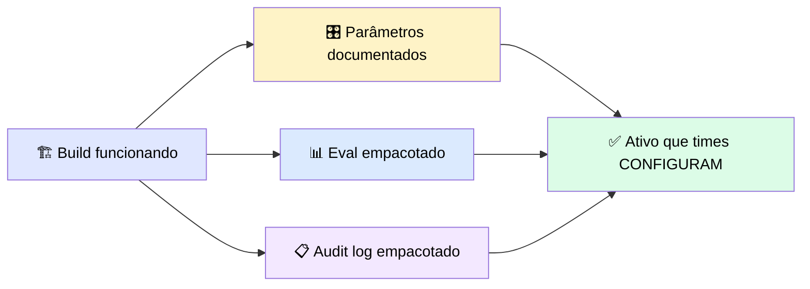
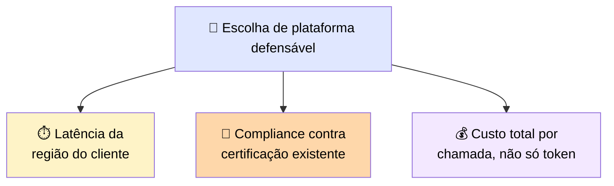
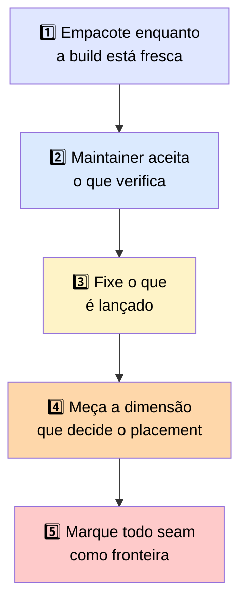

# 🏁 Cinco Conclusões-Chave

> 🎯 Uma conclusão por seção, amarrando o módulo inteiro.

---

## 1️⃣ Empacote enquanto a build está fresca

> 💬 Um accelerator mantém a lógica reusável, expõe as partes específicas de cliente como parâmetros documentados, e empacota o eval e o audit log junto com o ativo.

> <mark>O conhecimento do que é específico de cliente é mais caro de reconstruir depois que as pessoas que o tinham já saíram.</mark>

---

## 2️⃣ Um maintainer aceita o que consegue verificar

> 💬 Mover um ativo para infraestrutura compartilhada significa combiná-lo com o canal construído para sua forma, depois limpar a barra de revisão: código focado, exemplo executável, teste, e uma declaração de suposições — com direitos de licenciamento confirmados **antes** da revisão técnica.

> <mark>Uma contribuição que um revisor não consegue verificar fica no fim da fila. Prontidão é o que move um ativo privado para infraestrutura compartilhada em que outros constroem.</mark>

---

## 3️⃣ Fixe o que é lançado

> 💬 Escolha a plataforma de deployment com base na nuvem e postura de compliance do cliente, depois fixe a versão específica do modelo em vez do alias móvel, e mantenha a versão anterior disponível.

> 💡 **Analogia:** um alias é como pedir "a edição atual" de um livro — conveniente, mas o texto pode mudar. <mark>Fixar cita uma edição específica, então uma mudança upstream de modelo é algo que você adota deliberadamente, não algo que chega da noite para o dia sem caminho de rollback.</mark>

---

## 4️⃣ Meça a dimensão que decide o placement

> <mark>Para clientes regulados, compliance costuma ser pass-or-fail. Levantar compliance como restrição durante o scoping previne que ela rejeite a build depois, na revisão de contrato.</mark>

---

## 5️⃣ Marque todo seam como uma fronteira

> 💬 Uma aplicação multi-componente é só tão contida quanto seu seam mais privilegiado. Escope cada componente ao acesso mínimo que seu papel exige, e trate todo ponto onde dado cruza como uma fronteira de confiança. Conteúdo buscado é tratado como dado, não instruções.

> <mark>Confiança numa fronteira de componente deve ser explicitamente estabelecida. Não se transfere automaticamente do componente que enviou o dado.</mark> Quando um seam não pode ser assegurado, ele vai para um dono humano em vez de ser lançado.

---

## 🗺️ Mapa geral das cinco conclusões

---

> 🔮 **Fechamento do curso:** você agora consegue levar uma build funcionando até um ativo deployável e auditável — um accelerator reusável, uma contribuição que um maintainer consegue verificar, uma plataforma de deployment escolhida e versionada de propósito, e todo seam numa aplicação multi-componente marcado como uma fronteira de confiança. Isso completa o arco de build-a-deploy desta persona: de escrever código de produção nos módulos anteriores a lançar ativos que um cliente regulado consegue auditar e um time consegue reusar.
